# AI конспект для лекции #16

## Введение: что такое дерево

**Дерево** — это иерархическая структура данных, состоящая из узлов (nodes), соединённых рёбрами. Основные
характеристики:

- Есть **корень (root)** — единственный узел, у которого нет родителей.
- Каждый узел может иметь несколько **дочерних (children)** узлов.
- Узлы без дочерних называются **листьями (leaves)**.
- В дереве нет циклов.

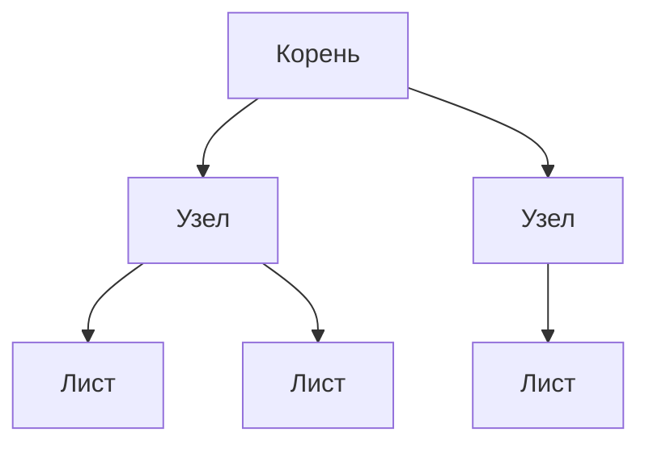

Деревья широко применяются в программировании: файловые системы, DOM, абстрактные синтаксические деревья (AST),
маршрутизация, базы данных и многое другое.

## Бинарное дерево поиска (BST)

**Бинарное дерево поиска (Binary Search Tree, BST)** — это дерево, где каждый узел имеет не более двух дочерних узлов (
левый и правый), и выполняется **свойство упорядоченности**:

- Все значения в **левом поддереве** меньше значения текущего узла.
- Все значения в **правом поддереве** больше значения текущего узла.

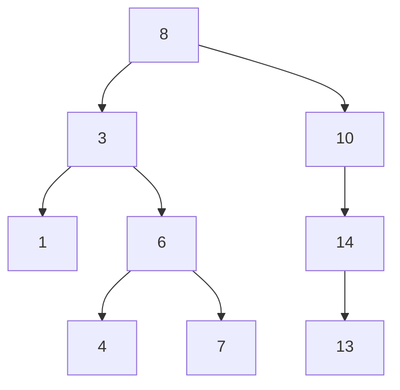

**Алгоритм вставки (без балансировки):**

1. Сравниваем вставляемое значение с текущим узлом (начинаем с корня).
2. Если значение меньше — идём в левое поддерево; если больше — в правое.
3. Если нужного ребёнка нет, вставляем новый узел на это место.
4. Если значение равно существующему — обычно игнорируем (дубликаты не храним).

**Алгоритм поиска:**

1. Сравниваем искомое значение с текущим узлом.
2. Если совпало — возвращаем узел.
3. Если меньше — уходим влево; если больше — вправо.
4. Если дошли до null — значение не найдено.

**Алгоритм поиска экстремумов:**

- **Минимум** — идём по левым указателям, пока не упрёмся в null. Последний узел — минимальный.
- **Максимум** — идём по правым указателям, пока не упрёмся в null.

**Алгоритм удаления:**

1. Находим удаляемый узел.
2. **Случай 1: узел — лист** — просто удаляем (родительский указатель обнуляется).
3. **Случай 2: узел имеет одного ребёнка** — заменяем удаляемый узел его ребёнком.
4. **Случай 3: узел имеет двух детей** — находим **преемника (successor)** — самый левый узел в правом поддереве (или
   предшественника — самый правый в левом поддереве), копируем его значение в удаляемый узел, затем удаляем преемника (
   он будет иметь не более одного ребёнка).

## Вырождение дерева в связный список

Если значения вставляются в отсортированном порядке (1, 2, 3, 4...), BST вырождается в **связный список**:

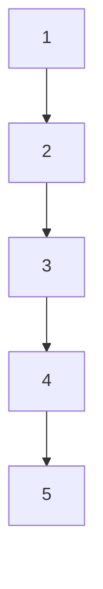

- Каждый новый узел становится правым ребёнком предыдущего.
- Глубина дерева становится равной количеству узлов.
- Сложность операций падает с O(log n) до **O(n)**.

Это главная проблема простого BST — он не гарантирует логарифмической высоты.

## Самобалансирующиеся деревья

**Самобалансирующиеся деревья** автоматически поддерживают высоту O(log n), выполняя **повороты (rotations)** после
вставки и удаления.

### AVL-дерево

- Названо по фамилиям изобретателей (Адельсон-Вельский, Ландис).
- Хранит в каждом узле **фактор баланса** (разницу высот левого и правого поддеревьев).
- Фактор баланса всегда должен быть -1, 0 или 1.
- При нарушении выполняются **одинарные или двойные повороты**.

### Красно-чёрное дерево (Red-Black Tree)

- Каждый узел помечен как красный или чёрный.
- **Правила раскраски:**
  1. Корень — всегда чёрный.
  2. У красного узла оба ребёнка — чёрные.
  3. Для любого узла все пути от него до листьев содержат одинаковое количество чёрных узлов (чёрная высота).

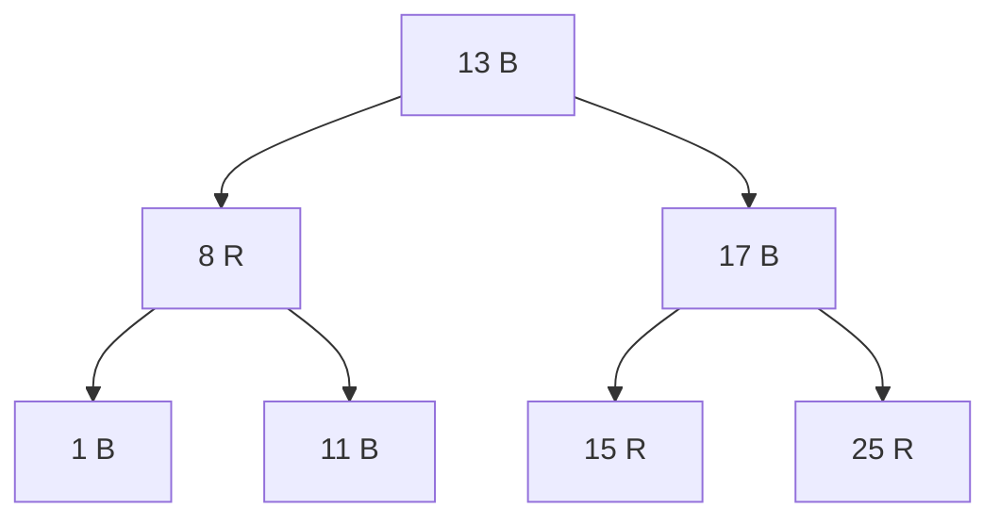

### Сравнение AVL и красно-чёрного дерева

| Характеристика   | AVL                         | Красно-чёрное                    |
|------------------|-----------------------------|----------------------------------|
| Баланс           | Строгий (разница высот ≤ 1) | Мягкий (чёрная высота одинакова) |
| Высота           | ~1.44 × log₂(n)             | ~2 × log₂(n)                     |
| Поиск            | Быстрее (дерево ниже)       | Медленнее (дерево выше)          |
| Вставка/удаление | Требует больше поворотов    | Требует меньше поворотов         |
| Память           | Фактор баланса (1 байт)     | Цвет (1 бит)                     |

## Преимущество деревьев перед хэш-таблицами

Хэш-таблицы дают O(1) поиска, но деревья выигрывают в сценариях:

1. **Упорядоченность** — дерево хранит элементы в отсортированном порядке, хэш-таблица — нет.
2. **Диапазонные запросы** — «найти все элементы между X и Y» — в дереве O(log n + k), в хэш-таблице O(n).
3. **Поиск минимума/максимума** — в дереве O(log n), в хэш-таблице O(n).
4. **Операции с соседями (predecessor/successor)** — в дереве O(log n), в хэш-таблице не поддерживаются.
5. **Гарантированная сложность в худшем случае** — у хэш-таблицы может быть O(n) при плохой хэш-функции или DoS-атаке, у
   сбалансированного дерева — O(log n) всегда.

## B-дерево

**B-дерево** — самобалансирующееся многопутевое дерево, оптимизированное для работы с диском. Свойства:

- У каждого узла может быть много детей (порядок m — обычно сотни).
- Все листья находятся на **одном уровне**.
- Узлы хранят несколько значений и ссылки на дочерние узлы.

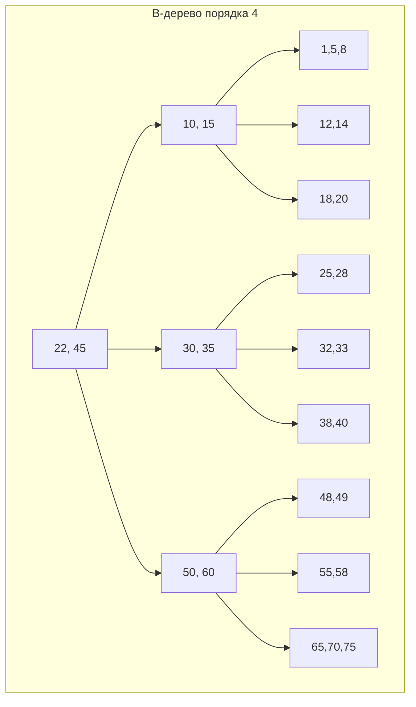

### Преимущество B-дерева

- **Минимальное количество обращений к диску** — высота дерева очень маленькая (обычно 2-4 уровня). Каждый узел может
  занимать целую страницу диска (4-16 КБ).
- **Локальность** — данные в узле хранятся последовательно, что хорошо для блочного чтения.

## B+ дерево

Вариант B-дерева, где:

- **Все данные хранятся только в листьях**.
- Внутренние узлы содержат только ключи-разделители и ссылки на дочерние узлы.
- Листья связаны в **связный список**.

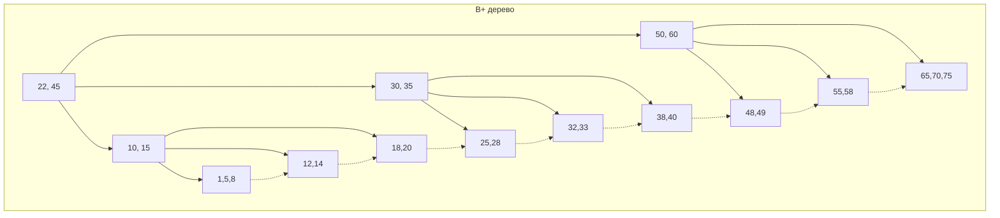

### B-дерево vs B+ дерево

| Характеристика    | B-дерево             | B+ дерево                     |
|-------------------|----------------------|-------------------------------|
| Хранение данных   | Во всех узлах        | Только в листьях              |
| Связь листьев     | Нет                  | Есть (связный список)         |
| Диапазонный поиск | Медленнее            | Быстрее                       |
| Высота            | Меньше (данные выше) | Больше (только ключи в узлах) |
| Использование     | Файловые системы     | Индексы БД                    |

## R-дерево

**R-дерево (Rectangle tree)** — структура для индексации **пространственных данных**. Свойства:

- Каждый узел содержит **ограничивающий прямоугольник (bounding box)**, охватывающий всех его потомков.
- Используется для поиска «найти все объекты в этом регионе» или «найти ближайшего соседа».

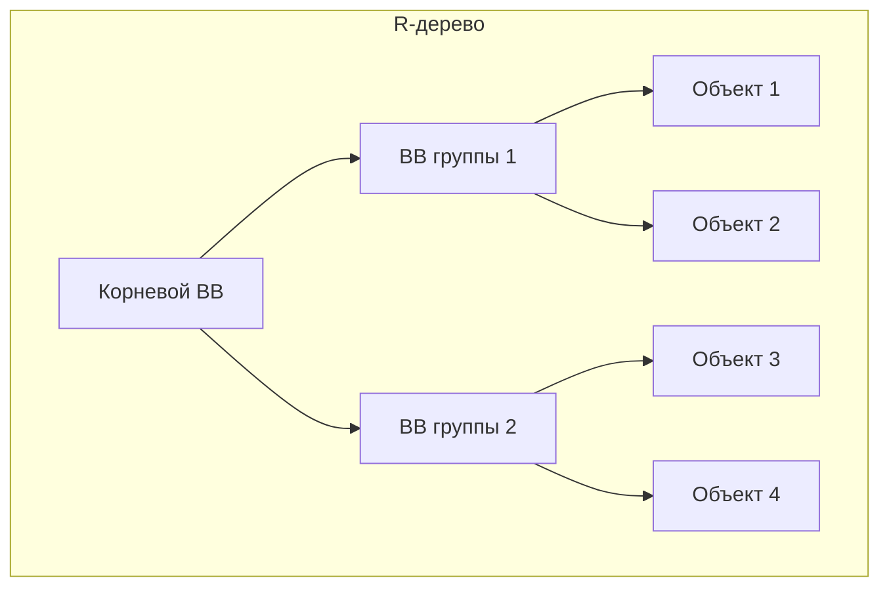

## Вложение дерева в массив

Способ улучшить локальность — хранить дерево в непрерывном массиве, а не в виде разрозненных узлов в куче. Вместо
указателей (ссылок) на детей используются **индексы в том же массиве**.

### Два подхода к реализации

**1. Статический массив фиксированного размера**

Выделяем массив заранее (например, на `MAX_NODES` элементов). Каждый узел — это структура (объект или несколько
параллельных массивов), содержащая значения и индексы детей.

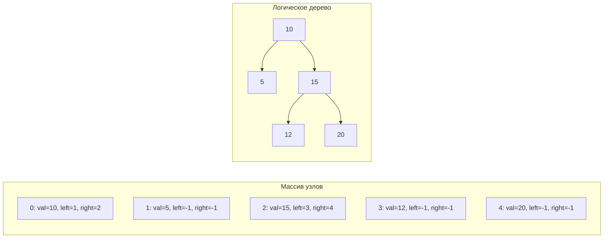

**Преимущества:**

- **Отличная локальность** — все узлы лежат рядом в памяти, кэш процессора эффективно загружает целые блоки.
- **Быстрый доступ** — доступ по индексу за O(1), без разыменования указателей.
- **Компактность** — нет накладных расходов на указатели (если использовать `int` вместо 64-битных ссылок).
- **Простота сериализации** — дерево можно сохранить на диск как есть.

**Недостатки:**

- Размер фиксирован — сложно расширять после выделения (требуется пересоздание массива).
- При вставке/удалении может потребоваться сдвиг элементов.

**2. Классическая «куча» (heap array) для полного бинарного дерева**

Если дерево является **полным** (близко к идеально сбалансированному), можно использовать компактное представление без
явных указателей:

- Корень — индекс 0.
- Для узла с индексом `i`:
  - Левый ребёнок: `2*i + 1`
  - Правый ребёнок: `2*i + 2`
  - Родитель: `Math.floor((i-1)/2)`

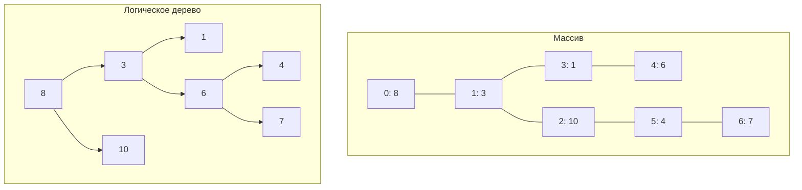

**Применение:**

- Бинарные кучи (очереди с приоритетом).
- Кэширование результатов (например, в алгоритмах динамического программирования).
- Встроенные системы с ограниченной памятью.

### Почему это важно для производительности

В классическом дереве узлы создаются через `new` и разбрасываются по куче. При обходе дерева процессор постоянно
загружает новые участки памяти в кэш, вызывая **промахи кэша (cache misses)**. Промах кэша может стоить в десятки раз
дороже обычного доступа к памяти.

При хранении дерева в массиве все узлы находятся в непрерывной области памяти. Обход в ширину (BFS) становится очень
быстрым, так как каждый следующий узел с высокой вероятностью уже загружен в кэш.

**Когда использовать вложение в массив:**

- Размер дерева известен заранее или есть разумный верхний предел.
- Частые обходы (особенно BFS).
- Работа в окружении с критичной производительностью (игры, встроенные системы).
- Данные нужно передавать через сеть или сохранять на диск.

**Когда лучше классические узлы:**

- Частые динамические вставки и удаления.
- Размер дерева сильно меняется и непредсказуем.
- Важна простота разработки, а не пиковая производительность.

## Roadmap выбора структуры данных

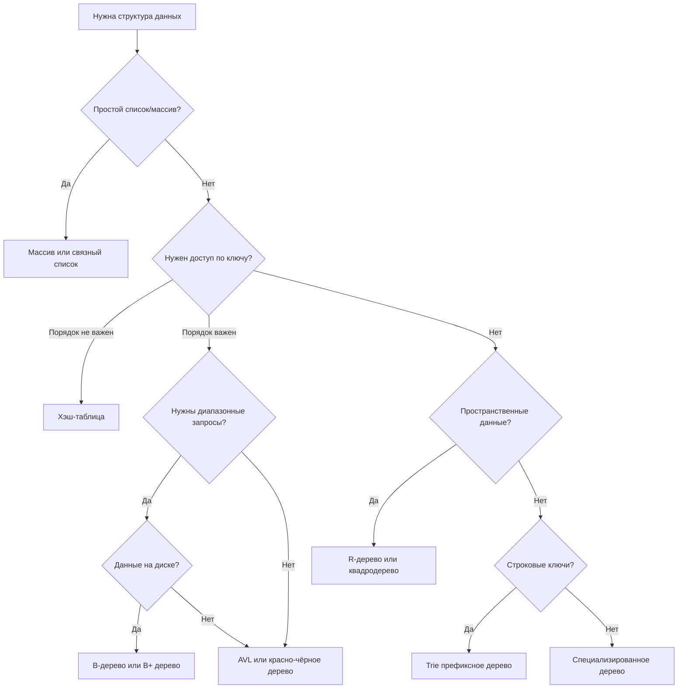

## Деревья не только для поиска

До этого момента мы говорили о деревьях как о структурах для упорядоченного хранения и быстрого поиска данных (BST,
B-деревья, R-деревья). Но деревья используются и в совершенно других областях, где поиск не является основной задачей.

### Абстрактное синтаксическое дерево (AST)

AST — это древовидное представление исходного кода программы. Каждый узел соответствует конструкции языка: оператору,
выражению, объявлению переменной, вызову функции.

**Пример:** выражение `(a + b) * c`

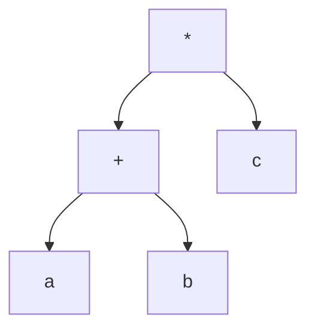

**Применение AST:**

- **Компиляторы и интерпретаторы** — после синтаксического анализа код превращается в AST, затем на его основе
  генерируется машинный код или байт-код.
- **Линтеры (ESLint)** — анализируют AST, чтобы находить проблемные паттерны в коде.
- **Форматтеры (Prettier)** — перестраивают AST в соответствии с правилами форматирования.
- **Транспиляторы (Babel, TypeScript)** — преобразуют AST одного языка в AST другого (или того же языка, но с новыми
  возможностями).
- **Рефакторинг** — инструменты IDE перестраивают AST при переименовании переменных, вынесении кода в функцию.

### Другие примеры деревьев не для поиска

| Тип дерева                     | Назначение                             | Поиск?                                        |
|--------------------------------|----------------------------------------|-----------------------------------------------|
| **DOM**                        | Представление HTML-документа           | нет (основная задача — отображение и события) |
| **Файловая система**           | Иерархия каталогов и файлов            | нет (это структура, а не индекс)              |
| **Куча (Heap)**                | Приоритетная очередь                   | нет (нужен только доступ к экстремуму)        |
| **Дерево вызовов (Call Tree)** | Профилирование, отладка                | нет (отслеживание потока выполнения)          |
| **Дерево решений**             | Машинное обучение                      | да, но не главное                             |
| **Дерево зависимостей**        | Пакетные менеджеры, сборщики (Webpack) | нет (нужен порядок сборки)                    |

### Иерархия как фундаментальная концепция

Везде, где есть **вложенность** или **иерархия**, появляется дерево. Это одна из самых естественных структур для
моделирования реальных объектов:

- Организационная структура компании (начальник → подчинённые).
- Категории товаров в интернет-магазине.
- Оглавление книги (части → главы → параграфы).
- История версий в Git (граф, близкий к дереву).

Понимание деревьев необходимо не только для алгоритмов поиска, но и для работы с любыми иерархическими данными.

## Итоги лекции

- **Деревья** — фундаментальная структура для иерархических данных, упорядоченного хранения и эффективного поиска.
- **Бинарное дерево поиска (BST)** — простой, но вырождается в список при отсортированных вставках.
- **Самобалансирующиеся деревья** (AVL, красно-чёрное) поддерживают высоту O(log n) ценой дополнительных операций.
- **Преимущество деревьев перед хэш-таблицами** — упорядоченность, диапазонные запросы, соседи, гарантированная
  сложность.
- **B-деревья и B+ деревья** — основа дисковых индексов в базах данных.
- **Проблема локальности** — классические бинарные деревья с узлами в куче плохо работают с кэшем.
- **Вложение дерева в массив** — решает проблему локальности ценой фиксированного размера.
- **Специализированные деревья** (R-дерево, Trie, квадродерево) решают конкретные задачи.
- **Деревья не только для поиска** — AST, DOM, файловые системы, иерархии в реальном мире.