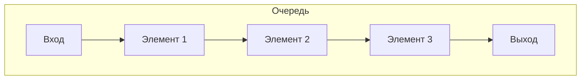
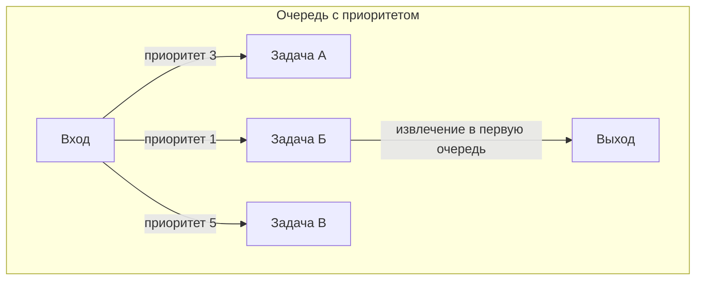
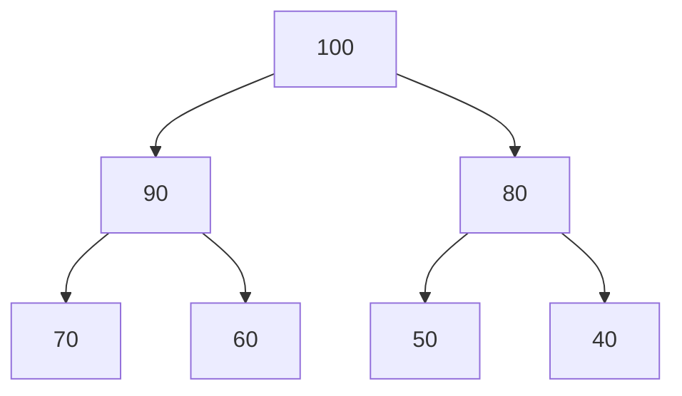
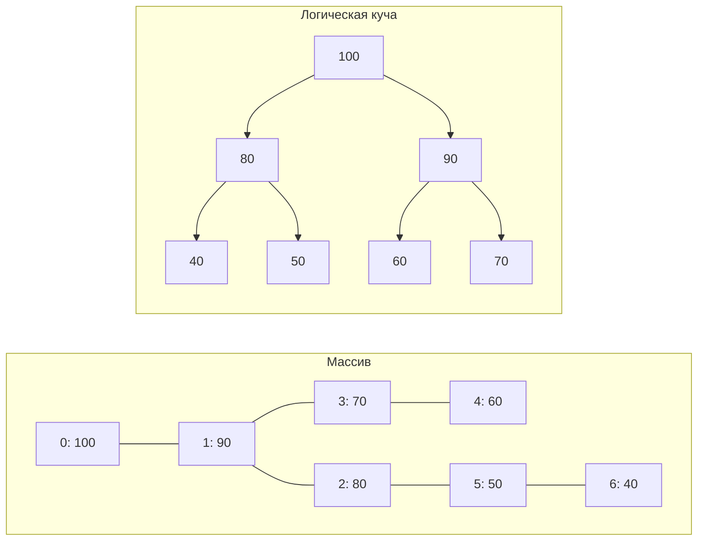

# AI конспект для лекции #17

## Введение: вспоминаем про очередь

**Очередь (Queue)** — структура данных, работающая по принципу **FIFO** (First In, First Out): первый добавленный
элемент извлекается первым.

Операции:

- `enqueue(value)` — добавить в конец очереди.
- `dequeue()` — извлечь из начала очереди.

Стандартная очередь не учитывает «важность» элементов. Все элементы равноправны.

## Очередь с приоритетом

**Очередь с приоритетом (Priority Queue)** — структура, где каждый элемент имеет **приоритет**. Элемент с наивысшим
приоритетом извлекается первым, независимо от порядка добавления.

**Аналогия:** в больнице пациенты с более тяжёлыми травмами обслуживаются вне очереди.

**Базовые операции:**

- `insert(value, priority)` — добавить элемент с указанным приоритетом.
- `extractMax()` (или `extractMin()`) — извлечь элемент с наивысшим (наименьшим) приоритетом.
- `peek()` — посмотреть на элемент с наивысшим приоритетом без извлечения.

## Наивные реализации

| Реализация                             | Вставка | Извлечение | Комментарий                      |
|----------------------------------------|---------|------------|----------------------------------|
| Несортированный массив/список          | O(1)    | O(n)       | Нужно каждый раз искать максимум |
| Сортированный массив/список            | O(n)    | O(1)       | При вставке сдвигаем элементы    |
| Двусвязный список с поддержкой порядка | O(n)    | O(1)       | Поиск места вставки за O(n)      |

Все наивные реализации дают O(n) хотя бы для одной из операций. Нужно лучше.

## Реализация через сбалансированные деревья поиска

Сбалансированное дерево (AVL, красно-чёрное) может хранить пары `(приоритет, значение)`, упорядоченные по приоритету.

- **Вставка** — O(log n) (стандартная вставка в дерево).
- **Извлечение максимума** — O(log n) (найти самый правый узел и удалить его).

**Плюсы:** хорошая асимптотика, возможность произвольного доступа по приоритету.
**Минусы:** сложность реализации, накладные расходы на поддержание баланса, дополнительная память под ссылки.

## Реализация через частично упорядоченное дерево

Вместо полного порядка (как в BST) можно ослабить требования: потребовать, чтобы **приоритет родителя был не меньше (или
не больше) приоритетов детей**. Этого достаточно для очереди с приоритетом, потому что нам не нужен поиск произвольного
элемента — только доступ к максимуму (минимуму).

**Свойство кучи (heap property):** для каждого узла его значение больше или равно значениям его детей (для max-кучи).

## Применение очереди с приоритетом

| Область                              | Пример                                                                                   |
|--------------------------------------|------------------------------------------------------------------------------------------|
| **Операционные системы**             | Планировщик задач (процессы с высоким приоритетом получают больше процессорного времени) |
| **Алгоритмы на графах**              | Алгоритм Дейкстры, алгоритм Прима (поиск кратчайших путей и минимального остова)         |
| **Сжатие данных**                    | Алгоритм Хаффмана (построение оптимального префиксного кода)                             |
| **Симуляции**                        | Обработка событий в порядке их времени наступления                                       |
| **Сетевые протоколы**                | Очереди пакетов с разными приоритетами QoS                                               |
| **Задачи искусственного интеллекта** | Поиск A* (эвристический поиск)                                                           |

## Бинарная куча (binary heap)

**Бинарная куча** — это **полное бинарное дерево** (complete binary tree), для которого выполняется **свойство кучи**.
Она является самой популярной реализацией очереди с приоритетом.

**Полное бинарное дерево** — все уровни заполнены, кроме последнего, который заполняется слева направо.

### Реализация на массиве

Благодаря тому, что куча — это **полное бинарное дерево**, её можно эффективно хранить в массиве:

- Корень — индекс `0`
- Для узла с индексом `i`:
  - Левый ребёнок: `2*i + 1`
  - Правый ребёнок: `2*i + 2`
  - Родитель: `Math.floor((i-1)/2)`

**Преимущества:**

- **Отличная локальность данных** — все элементы лежат в непрерывном массиве, кэш процессора работает эффективно.
- **Экономия памяти** — не нужны указатели на детей.
- **Быстрый доступ** — вычисление индексов за O(1).

### Алгоритм вставки (push / insert)

1. Добавляем новый элемент в **конец массива** (на последний уровень кучи).
2. **«Просеиваем вверх» (sift up / bubble up)** — сравниваем элемент с родителем:
  - Если элемент больше родителя (для max-кучи) — меняем их местами.
  - Повторяем до тех пор, пока элемент не окажется на своём месте или не достигнет корня.

**Сложность:** O(log n) — высота кучи.

### Алгоритм удаления (extractMax / extractMin)

Извлекается **корневой элемент** (максимум для max-кучи, минимум для min-кучи):

1. Сохраняем значение корня (это будет результат).
2. Заменяем корень **последним элементом** в массиве (самым правым на последнем уровне).
3. Удаляем последний элемент (уменьшаем размер).
4. **«Просеиваем вниз» (sift down / heapify)** — сравниваем корень с детьми:
  - Находим среди детей максимальный (для max-кучи).
  - Если ребёнок больше родителя — меняем их местами с максимальным ребёнком.
  - Повторяем до восстановления свойства кучи.

**Сложность:** O(log n).

### Алгоритм построения кучи из массива (heapify)

Если дан неупорядоченный массив, его можно превратить в кучу за O(n):

1. Начинаем с **последнего нелистового узла** (индекс `floor(n/2)-1`).
2. Для каждого узла вызываем `siftDown`.
3. Поднимаемся вверх до корня.

**Почему O(n), а не O(n log n)?** Хотя каждый `siftDown` в худшем случае O(log n), количество операций на верхних
уровнях мало, и суммарная сложность — линейная.

## Другие структуры для реализации очереди с приоритетом

| Структура               | Вставка  | extractMin | Память   | Комментарий                                    |
|-------------------------|----------|------------|----------|------------------------------------------------|
| Бинарная куча           | O(log n) | O(log n)   | O(n)     | Стандарт, хорошая локальность                  |
| Фибоначчиева куча       | O(1)     | O(log n)*  | O(n)     | *амортизированно, сложно в реализации          |
| Куча Бродала            | O(1)     | O(log n)   | O(n)     | Теоретический интерес                          |
| Сбалансированное дерево | O(log n) | O(log n)   | O(n)     | Больше памяти, но есть поиск                   |
| Колесо (Wheel)          | O(1)     | O(1)*      | O(range) | Только для целых приоритетов в малом диапазоне |

## Пирамидальная сортировка (heap sort)

**Heap sort** — алгоритм сортировки, использующий бинарную кучу:

1. Превращаем массив в кучу за O(n).
2. Многократно извлекаем корень (максимум) и помещаем его в конец массива:
  - Меняем корень с последним элементом.
  - Уменьшаем размер кучи.
  - Просеиваем новый корень вниз.
3. После N итераций массив отсортирован (по возрастанию для max-кучи).

**Характеристики:**

- Сложность: **O(n log n)** во всех случаях (лучший, средний, худший).
- Память: **O(1)** дополнительной (сортировка на месте).
- Нестабильная (не сохраняет порядок равных элементов).

## Итоги лекции

- **Очередь с приоритетом** — структура для доступа к элементу с наибольшим (наименьшим) приоритетом.
- **Наивные реализации** (массивы, списки) дают O(n) для одной из операций.
- **Сбалансированные деревья** дают O(log n) для всех операций, но сложны и требуют больше памяти.
- **Бинарная куча** — оптимальный выбор для большинства задач:
  - Реализация на массиве (отличная локальность данных).
  - Вставка — O(log n) (просеивание вверх).
  - Извлечение — O(log n) (просеивание вниз).
  - Построение кучи из массива — O(n).
- **Heap sort** — сортировка на месте за O(n log n) с использованием кучи.