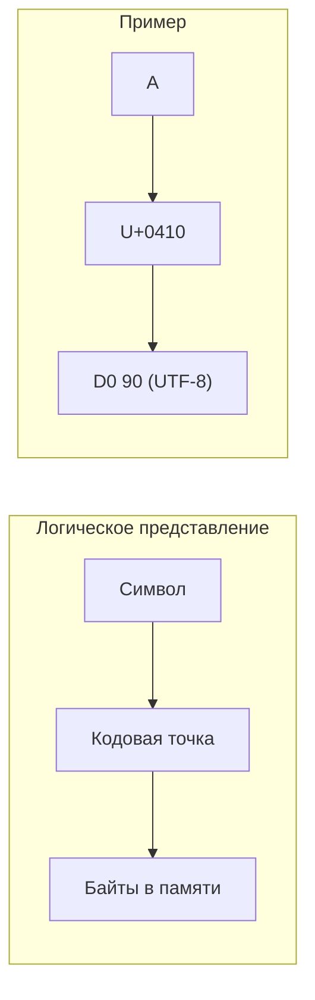
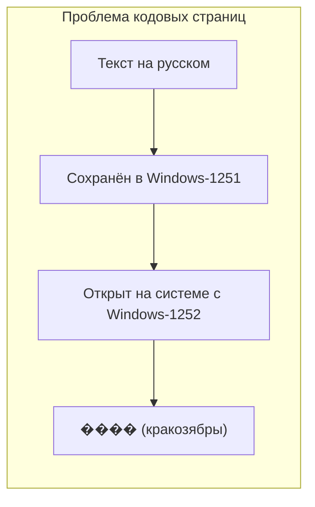
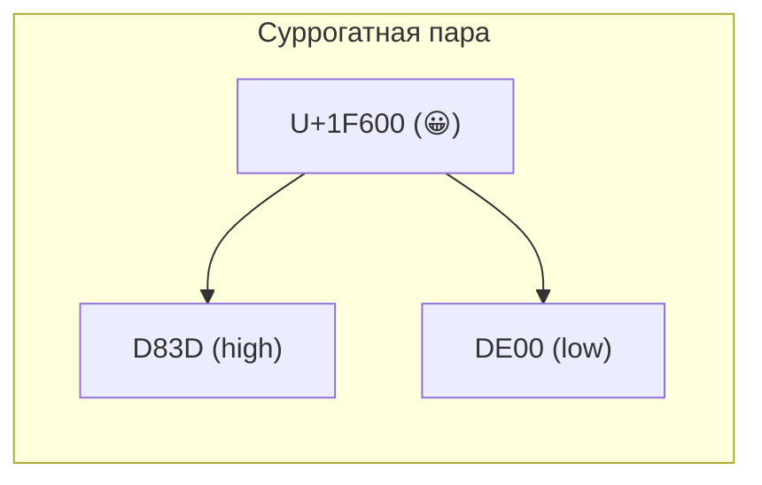
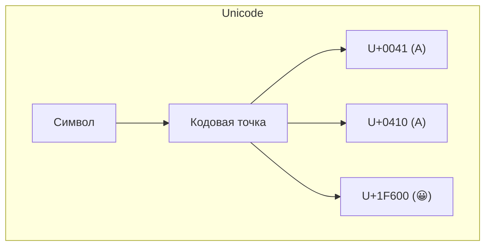
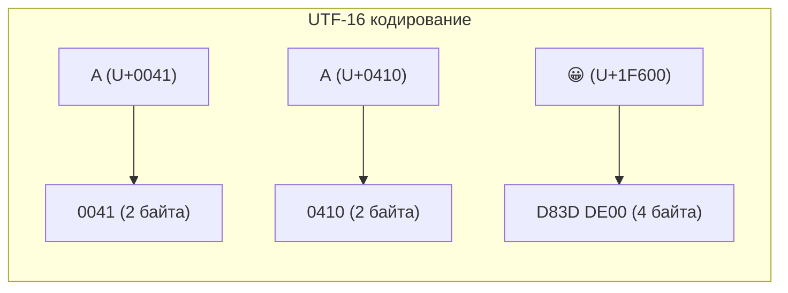
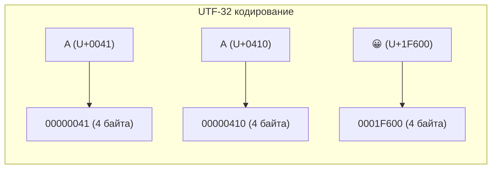
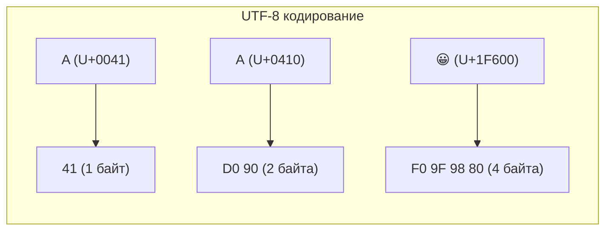
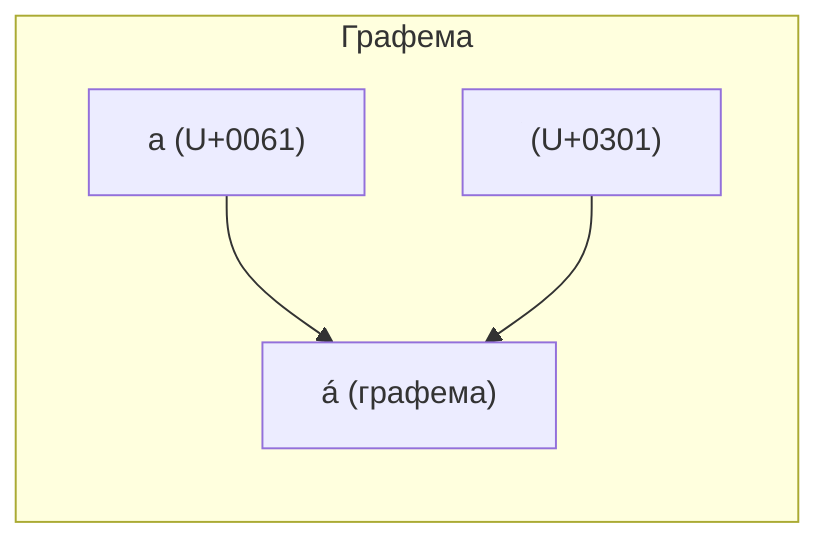

# AI конспект для лекции #18

## Введение: символы и строки — базовые определения

**Символ (character)** — минимальная единица письменности: буква, цифра, знак препинания, иероглиф, пробел.

**Строка (string)** — упорядоченная последовательность символов.

Казалось бы, всё просто. Но проблема в том, что компьютеры работают с числами (байтами), а не с символами. Нужен способ
**отображать символы в числа** и обратно. Эту задачу решают **кодировки**.

## Как строка представлена в памяти

В памяти строка — это последовательность байтов (или более крупных единиц). Каждый символ кодируется одним или
несколькими байтами в зависимости от кодировки.



## ASCII — фундамент всех кодировок

**ASCII (American Standard Code for Information Interchange)** — самая базовая и важная кодировка в истории
вычислительной техники.

- Разработана в 1963 году.
- Использует **7 бит** → 128 символов (0–127).
- Включает:
  - Управляющие символы (0–31): `\n` (10), `\r` (13), `\t` (9), `\0` (0).
  - Печатные символы (32–126): латинские буквы (A-Z, a-z), цифры (0-9), знаки препинания, пробел.
  - Символ `DEL` (127) — удаление.

```text
ASCII таблица (фрагмент):
65 → A    66 → B    67 → C
97 → a    98 → b    99 → c
48 → 0    49 → 1    50 → 2
```

**Ключевое свойство ASCII:** все современные кодировки, так или иначе, **совместимы с ASCII** для первых 128 символов.
Это означает:

- Символы `A-Z`, `a-z`, `0-9`, основные знаки препинания в любой популярной кодировке (UTF-8, Windows-1251, KOI8-R,
  CP1252 и др.) имеют **те же байтовые значения**, что и в ASCII.
- Любой текст, состоящий только из ASCII-символов, будет корректно отображаться в любой современной кодировке.

## Множество кодовых страниц

До появления Unicode каждый язык или регион использовал свою **кодовую страницу (codepage)**:

- **Windows-1251** — кириллица
- **Windows-1252** — западноевропейские языки
- **KOI8-R** — русская кодировка
- **GB2312** — упрощённый китайский
- **Shift-JIS** — японский

**Проблемы кодовых страниц:**

- Одна кодовая страница не может содержать символы всех языков.
- Один и тот же код в разных кодовых страницах означает разные символы.
- При передаче текста между системами с разными кодовыми страницами происходит «кракозябры».



## Мнемонические последовательности

До Unicode также использовались **мнемонические последовательности** для отображения специальных символов.

**HTML-мнемоники (сущности)** — наиболее известный пример:

- `&amp;` → `&`
- `&lt;` → `<`
- `&gt;` → `>`
- `&copy;` → `©`
- `&#169;` → `©` (числовой код)

Но мнемоники использовались и в других контекстах: настройка терминалов, escape-последовательности в языках
программирования, разметка документов.

**В чём была проблема:** если кодировка документа не содержит символа, который нужно отобразить (скажем, знак авторского
права © или математическую греческую букву), то его невозможно записать «как есть» — в кодовой странице для него просто
нет байтового значения.

**С развитием интернета проблема стала особенно острой:**

- Веб-страницы создавались в разных странах с разными кодовыми страницами.
- При обмене данными между странами и системами текст «ломается», если кодировки не совпадают.
- Не существовало единого стандарта для всех языков, что делало интернет «лоскутным одеялом» из несовместимых кодировок.
- Пользователи из разных стран видели кракозябры вместо текста на сайтах.

**Решение:** вместо «живого» символа использовали мнемоническую последовательность. Браузер, встречая мнемонику,
отображал нужный символ, даже если в кодировке страницы его нет.

Это было **временным костылём**, который работал только для ограниченного набора символов и только при условии, что
браузер знает мнемонику. С приходом Unicode и UTF-8 необходимость в мнемониках почти отпала — теперь любой символ можно
записать напрямую в UTF-8, и он будет корректно отображаться в любом современном браузере и на любой платформе.

## UCS2

**UCS-2 (Universal Character Set — 2 bytes)** — одна из первых попыток создать универсальную кодировку. Использовал *
*фиксированные 2 байта (16 бит)** на символ, что давало 65536 возможных символов.

**Проблема:** 65536 символов недостаточно для всех письменностей мира. Даже только китайских иероглифов десятки тысяч.

UCS-2 был принят в ранних версиях JavaScript (и остаётся в основе внутреннего представления строк в JS до сих пор, хотя
формально это уже UTF-16).

## Кодирование через суррогатные пары

Чтобы расширить диапазон кодируемых символов без перехода на 4 байта, была придумана техника **суррогатных пар (
surrogate pairs)**.

Идея: часть значений 16-битного диапазона резервируется под **суррогатные коды**:

- **High surrogate (D800–DBFF)** — старшая половина суррогатной пары.
- **Low surrogate (DC00–DFFF)** — младшая половина суррогатной пары.

Из двух суррогатов формируется кодовая точка в диапазоне U+10000–U+10FFFF.



**Важно:** суррогатная пара — это **два 16-битных значения**, но **один логический символ**.

## Юникод (Unicode)

**Юникод** — это стандарт, который решает проблему кодовых страниц раз и навсегда. Его ключевые идеи:

1. **Единая таблица символов** — каждому символу (из любого языка, любой письменности, любой эпохи) присвоен уникальный
   номер — **кодовая точка (code point)**.
2. **Кодовое пространство** — от U+0000 до U+10FFFF (более 1 миллиона позиций).
3. **Независимость от кодировки** — Юникод определяет только отображение «символ → номер». Как этот номер хранить в
   байтах — решают конкретные кодировки (UTF-8, UTF-16, UTF-32).



**Структура Unicode:**

- **Basic Multilingual Plane (BMP)** — U+0000..U+FFFF (первые 65536 кодовых точек). Содержит большинство символов
  современных языков.
- **Supplementary Planes** — U+10000..U+10FFFF (остальные 16 плоскостей). Содержат редкие символы, эмодзи, древние
  письменности.

## UTF-16

**UTF-16 (Unicode Transformation Format — 16-bit)** — кодировка, в которой:

- Символы из BMP (U+0000..U+FFFF) кодируются **одним 16-битным значением**.
- Символы за пределами BMP (U+10000..U+10FFFF) кодируются **суррогатной парой** (два 16-битных значения).



**Характеристики:**

- Переменная длина: 2 или 4 байта.
- Используется в JavaScript, .NET, Java, Windows API.
- Конечный порядок байтов (endianness) важен — есть BOM (Byte Order Mark).

## UTF-32

**UTF-32** — кодировка с **фиксированной длиной 4 байта (32 бита)** на символ.



**Характеристики:**

- Простота — каждый символ всегда занимает ровно 4 байта.
- Конечный порядок байтов (endianness) важен — есть BOM (Byte Order Mark).
- **Огромный расход памяти** — даже для текста на английском в 4 раза больше, чем UTF-8.
- Используется во внутренних представлениях строк и символов в некоторых языках программирования:
  - **В Rust** тип `char` — это 32-битное значение (4 байта), представляющее корректную кодовую точку Unicode (
    U+0000..U+10FFFF). Строки в Rust (`String`, `&str`) хранятся в UTF-8, а итерация по символам возвращает `char` (4
    байта).
  - **В языке C** тип `char32_t` (стандарт C11) предназначен для хранения 32-битных кодовых точек Unicode.
  - **В C++** тип `char32_t` (начиная с C++11) для аналогичных целей.
  - **В Python 3** строки хранятся внутренне в одном из форматов (Latin-1, UCS-2, UCS-4) в зависимости от содержимого.
    При использовании широких символов (UCS-4) — это фактически UTF-32.
- В вебе и для хранения/передачи данных практически не используется из-за неэффективности.

## UTF-8

**UTF-8** — самая популярная кодировка в интернете. Она использует **переменное число байтов** для кодирования одной
кодовой точки:

| Диапазон кодовых точек | Байты   | Схема                                 |
|------------------------|---------|---------------------------------------|
| U+0000..U+007F (ASCII) | 1 байт  | `0xxxxxxx`                            |
| U+0080..U+07FF         | 2 байта | `110xxxxx 10xxxxxx`                   |
| U+0800..U+FFFF         | 3 байта | `1110xxxx 10xxxxxx 10xxxxxx`          |
| U+10000..U+10FFFF      | 4 байта | `11110xxx 10xxxxxx 10xxxxxx 10xxxxxx` |



**Преимущества UTF-8:**

- **Обратно совместима с ASCII** — текст на английском занимает столько же байтов (1 байт на символ), что критично для
  совместимости со старыми системами и протоколами.
- **Экономична для текстов на латинице** — большинство символов кодируются 1 байтом (в отличие от UTF-16, где всегда 2
  байта).
- **Нет проблем с порядком байтов (endianness)** — UTF-8 оперирует байтами, а не 16-битными словами, поэтому порядок
  байтов не имеет значения.
- **Самосинхронизирующаяся** — по байтам можно определить границу символа. Если байт потерян или повреждён, можно
  восстановиться на следующем символе.
- **Сетевой стандарт** — UTF-8 является доминирующей кодировкой в интернете: HTML, JSON, XML, HTTP-заголовки, email и
  большинство веб-протоколов используют UTF-8 по умолчанию.

**Недостатки UTF-8:**

- **Для некоторых письменностей занимает больше байтов, чем UTF-16**:
  - Для кириллицы ситуация примерно одинаковая: большинство кириллических символов в UTF-8 занимают 2 байта, в
    UTF-16 — тоже 2 байта.
  - Для китайских, японских и корейских иероглифов (CJK) UTF-8 занимает **3 байта**, тогда как UTF-16 — 2 байта. Для
    редких иероглифов (вне BMP) оба занимают 4 байта (UTF-8 — 4 байта, UTF-16 — суррогатная пара из 2×2 = 4 байта).
  - Для эмодзи и редких символов (вне BMP) UTF-8 занимает 4 байта, UTF-16 — 4 байта (суррогатная пара) — одинаково.
- **Переменная длина** — усложняет некоторые операции (например, получение N-го символа без полного декодирования). В
  UTF-16 для BMP-символов (основная часть текста) длина фиксирована (2 байта), что упрощает индексацию.

## Byte Order Mark (BOM)

**BOM (Byte Order Mark)** — специальный маркер в начале текстового файла, указывающий на порядок байтов (endianness) для
кодировок с переменным порядком байтов.

### Проблема порядка байтов

Для кодировок, использующих 2 или 4 байта на единицу (UTF-16, UTF-32), важен порядок, в котором байты записываются в
память или на диск:

- **Little-endian** — младший байт первым (x86, x86-64).
- **Big-endian** — старший байт первым (сетевые протоколы, некоторые архитектуры).

Один и тот же символ `U+0410` (А) в UTF-16 может быть записан как:

```text
FE FF 04 10  (UTF-16 BE — big-endian)
FF FE 10 04  (UTF-16 LE — little-endian)
```

### Сетевой порядок байтов (network byte order)

В интернете сложилась **негласная договорённость** использовать **big-endian** (сетевой порядок) для передачи данных по
сети. Это исторически связано с протоколами TCP/IP, где все целочисленные поля передаются в big-endian.

UTF-8, будучи **сетевым стандартом** (доминирующая кодировка в HTTP, HTML, JSON, XML), **не нуждается в BOM**, так как:

- UTF-8 оперирует байтами, а не 16-битными или 32-битными словами.
- Порядок байтов в UTF-8 всегда одинаков — это последовательность байтов.
- BOM в UTF-8 (`EF BB BF`) несёт смысловую нагрузку только как маркер «этот файл в UTF-8», но не для определения порядка
  байтов.

Тем не менее, многие приложения (особенно под Windows) сохраняют BOM в UTF-8 файлах, что создаёт совместимостные
проблемы в Unix-среде.

### BOM как решение

В начало файла записывается специальный символ **U+FEFF** (Zero Width No-Break Space). Его байтовое представление в
UTF-16/UTF-32 показывает порядок байтов:

| Кодировка | BOM (шестнадцатерично) |
|-----------|------------------------|
| UTF-8     | EF BB BF               |
| UTF-16 BE | FE FF                  |
| UTF-16 LE | FF FE                  |
| UTF-32 BE | 00 00 FE FF            |
| UTF-32 LE | FF FE 00 00            |

### BOM в UTF-8

В UTF-8 BOM (`EF BB BF`) **технически не нужен** для определения порядка байтов (в UTF-8 его нет), но некоторые
системы (например, Windows Notepad) используют его для определения, что файл сохранён в UTF-8, а не в другой кодировке (
ANSI).

**Проблема BOM в UTF-8:** многие Unix-утилиты и скрипты не ожидают BOM в начале файла. Например, шебанг (
`#!/usr/bin/env node`) в скриптах не работает, если перед ним стоит BOM.

### BOM в вебе и программировании

| Среда                        | Отношение к BOM                                            |
|------------------------------|------------------------------------------------------------|
| HTML5                        | Допускает BOM, игнорирует его                              |
| JSON (RFC 8259)              | **Явно запрещает BOM** в начале JSON-документа             |
| JavaScript исходники         | Обычно без BOM, но многие редакторы добавляют опционально  |
| Windows приложения (Notepad) | Часто добавляют BOM для UTF-8                              |
| Unix/Linux                   | BOM часто создаёт проблемы (скрипты, компиляторы)          |
| HTTP                         | Кодировка определяется заголовком `Content-Type`, а не BOM |

### Практические рекомендации

- **Для UTF-8** — предпочтительно **не использовать BOM** (особенно в вебе и в коде), так как это нарушает совместимость
  с Unix-инструментами.
- **Для UTF-16 / UTF-32** — BOM **обязателен** или должен быть заранее известен порядок байтов.
- **Современные редакторы** позволяют настраивать добавление BOM при сохранении.

## JavaScript и UTF-16

В JavaScript строки **внутренне** хранятся в кодировке UTF-16 (точнее, в формате, основанном на UCS-2 с поддержкой
суррогатных пар). Это историческое наследие.

```javascript
const str = "😀";
console.log(str.length); // 2 — длина в 16-битных единицах!
console.log(str[0]); // "\uD83D" — high surrogate
console.log(str[1]); // "\uDE00" — low surrogate
console.log([...str].length); // 1 — правильно считает символы
```

**Важное следствие:** `length`, индексация по `[]`, `charAt()` работают с **16-битными единицами** кода (кодовыми
единицами), а не с логическими символами (кодовыми точками). Для работы с символами нужно использовать методы нового
стандарта.

## Почему JS использует UTF-16?

Исторические причины:

1. JavaScript был создан в 1995 году в Netscape.
2. На тот момент Юникод уже существовал, а стандарт UTF-16 ещё не был принят, но был стандарт UCS-2 (фиксированный 2
   байта).
3. Netscape выбрал UCS-2 как внутреннее представление строк для простоты и унификации.
4. Позже, когда появился UTF-16 и необходимость в символах вне BMP, JavaScript «унаследовал» UCS-2 и был доработан для
   поддержки суррогатных пар (но не везде — например, `length` до сих пор считает 16-битные единицы).

## Нюансы с суррогатными парами в JS

| Операция             | Поведение                                     | Правильный способ  |
|----------------------|-----------------------------------------------|--------------------|
| `str.length`         | Считает 16-битные единицы                     | `[...str].length`  |
| `str[0]`             | Возвращает суррогат                           | `[...str][0]`      |
| `charAt()`           | Возвращает суррогат                           | `[...str][0]`      |
| `charCodeAt()`       | Возвращает 16-битный код                      | `codePointAt()`    |
| `fromCharCode()`     | Не работает с > U+FFFF                        | `fromCodePoint()`  |
| `split('')`          | Разбивает по суррогатам                       | `[...str]`         |
| Регулярные выражения | `.` не захватывает суррогатную пару полностью | Флаг `u` (unicode) |

```javascript
const str = "😀";

// До ES6 (неправильно)
console.log(str.charCodeAt(0)); // 55357 (D83D)
console.log(str.charCodeAt(1)); // 56832 (DE00)

// С ES6 (правильно)
console.log(str.codePointAt(0)); // 128512 (1F600)
console.log(String.fromCodePoint(128512)); // "😀"

// Регулярные выражения с флагом u
console.log(/^.$/.test(str)); // false
console.log(/^.$/u.test(str)); // true
```

## Кодировка исходных данных и кодировка строк

Важно различать два понятия:

1. **Кодировка исходного файла** — в какой кодировке сохранён файл с исходным кодом (обычно UTF-8).
2. **Внутреннее представление строки в памяти** — как движок хранит строку во время выполнения (в JS это UTF-16).

В большинстве современных сред (браузеры, Node.js) исходные файлы ожидаются в UTF-8. Но когда строка загружается в
память, она преобразуется во внутреннее представление (UTF-16). При сохранении или отправке — обратно в UTF-8 (или
другую кодировку).

## API TextEncoder и TextDecoder

Современные среды предоставляют API для преобразования строк в байты и обратно:

**TextEncoder** — преобразует строку в `Uint8Array` в кодировке UTF-8.

```javascript
const encoder = new TextEncoder();
const bytes = encoder.encode("Привет, мир!");
// Uint8Array [208, 159, 208, 190, ...]
```

**TextDecoder** — преобразует байты обратно в строку.

```javascript
const decoder = new TextDecoder('utf-8');
const str = decoder.decode(bytes);
// "Привет, мир!"
```

Поддерживаются и другие кодировки: `'utf-8'`, `'windows-1251'`, `'iso-8859-1'` и др.

## Строки в JS

Строки в JavaScript — это **неизменяемые (immutable)** последовательности 16-битных значений.

**Особенности:**

- Неизменяемость — строки нельзя изменить, только создать новую.
- `''`, `""`, ``` ```` — три способа объявления.
- Шаблонные строки (`` ` ``) поддерживают интерполяцию и многострочность.
- Строки — примитивный тип, но имеют объектные обёртки (`new String()`), которые на практике не используются.

## Оптимизации движков

Современные движки (V8, SpiderMonkey, JavaScriptCore) оптимизируют хранение строк:

**1. Внутренние стратегии хранения:**

- **Короткие строки (≤ 12–16 символов)** — могут храниться прямо внутри указателя (тегированный указатель), без
  выделения отдельной памяти.
- **Длинные строки** — выделяются в куче.
- **Строки с преобладанием одного языка** — используют компактные форматы (ASCII, Latin-1) для экономии памяти.

**2. Интернирование строк:**

- Движки интернируют строковые литералы — одинаковые литералы ссылаются на один объект в памяти.
- `str1 === str2` для литералов может работать быстро.

**3. Создание новой строки:**

- При конкатенации создаётся новая строка. Для многих операций в цикле это дорого.
- Используйте массивы + `.join()` для сборки больших строк.

**4. Строковые срезы (substring):**

- Современные движки не копируют данные для `substring` — создают объект, ссылающийся на исходную строку (ленивый срез).

## Комбинируемые символы и графемы в Unicode

В Unicode некоторые символы **комбинируются** с предыдущим, образуя новый глиф. Важно различать понятия:

- **Кодовая точка (code point)** — числовой идентификатор символа в таблице Unicode.
- **Графема (grapheme)** — минимальная визуально различимая единица письменности, которую пользователь воспринимает как
  один «символ» на экране.

Одна графема может состоять из **нескольких кодовых точек**.



**Примеры:**

- **Базовый символ + диакритический знак:** `a` + `́` → `á` (две кодовые точки, одна графема).
- **Буква + диакритика + диакритика:** `e` + `́` + `̧` → `ế` (три кодовые точки, одна графема).
- **Лигатура:** `fl` (U+FB02) — одна кодовая точка, одна графема.
- **Эмодзи с модификаторами кожи:** `👋` + `🏽` → `👋🏽` (две кодовые точки, одна графема).

```javascript
const str = "a\u0301"; // "á" как две кодовые точки
console.log(str.length); // 2 — length считает кодовые единицы
console.log([...str].length); // 2 — даже итерация по кодовым точкам даёт 2
console.log([...new Intl.Segmenter().segment(str)].length); // 1 — правильная графема!
```

### Комбинируемые эмодзи

Особенно интересны комбинируемые эмодзи. В Unicode есть специальные символы-модификаторы и соединители:

- **ZWJ (Zero Width Joiner, U+200D)** — соединяет несколько эмодзи в один составной.
- **Модификаторы кожи (U+1F3FB..U+1F3FF)** — меняют цвет кожи эмодзи с человекам.
- **Флаги** — состоят из двух региональных индикаторов (например, U+1F1FA + U+1F1F8 → 🇺🇸).

```javascript
// Семья с детьми — составной эмодзи через ZWJ
const family = "👨‍👩‍👧‍👦";
console.log(family.length); // 11 (!) — множество кодовых точек
console.log([...family].length); // 7 — семь кодовых точек
console.log([...new Intl.Segmenter().segment(family)].length); // 1 — одна графема

// Модификатор кожи
const hand = "👋🏽"; // 👋 + модификатор кожи
console.log(hand.length); // 2
console.log([...new Intl.Segmenter().segment(hand)].length); // 1
```

### Следствия для программиста

- **Визуальная длина ≠ `length`** — никогда не используйте `str.length` для ограничения видимой длины текста (например,
  для обрезки комментариев или никнеймов).
- **Сравнение строк** — визуально одинаковые строки могут иметь разные кодовые последовательности и давать `false` при
  сравнении. Используйте нормализацию.
- **Регулярные выражения** — для работы с графемами используйте флаг `u` и класс `\p{...}`.
- **Индексация** — `str[0]` может вернуть суррогат или первый байт составной графемы, а не визуальный символ.

```javascript
// Правильный способ получить первый "символ" (графему)
const firstGrapheme = [...new Intl.Segmenter().segment(str)][0]?.segment || '';

// Регулярное выражение для поиска графем (с флагом u)
const graphemes = str.match(/\p{RGI_Emoji}|\p{L}\p{M}*|\p{N}|\p{P}/gu) || [];
```

## Нормализация строк

**Нормализация** — приведение строк к каноническому виду. Unicode определяет несколько форм нормализации:

| Форма                                      | Описание                                                                         |
|--------------------------------------------|----------------------------------------------------------------------------------|
| **NFD** (Normalization Form Decomposition) | Разложение — все комбинируемые символы разбиваются на отдельные кодовые точки    |
| **NFC** (Normalization Form Composition)   | Композиция — разложенные символы собираются обратно в составные (по возможности) |
| **NFKD**                                   | Совместимая декомпозиция (упрощает символы для сравнения)                        |
| **NFKC**                                   | Совместимая композиция                                                           |

```javascript
const str1 = "á";                     // U+00E1 (предварительно составленный)
const str2 = "a\u0301";               // a + U+0301 (разложенный)

console.log(str1 === str2);           // false
console.log(str1.normalize() === str2.normalize()); // true (по умолчанию NFC)
console.log(str1.normalize('NFD') === str2.normalize('NFD')); // true
```

**Когда нужна нормализация:**

- Поиск и сравнение строк (чтобы `"á"` и `"á"` считались равными).
- Ввод от пользователя (нельзя гарантировать, что символы будут в одной форме).
- Обработка текста перед сохранением в базу данных (единый формат).
- Сортировка и индексация (предсказуемое поведение).

## Сравнение строк и привязанность к локали

Сравнение строк в JavaScript (через операторы `<`, `>`, `<=`, `>=`) использует **лексикографическое сравнение кодовых
точек Unicode**. Это приводит к проблемам:

- В разных языках буквы имеют разный порядок: в шведском `ö` идёт после `z`, в немецком — внутри алфавита.
- Регистр букв: `"A" < "a"` (код A = 65, a = 97) — это не всегда правильно для сравнения.
- Диакритические знаки: `"é"` и `"e"` должны сравниваться по-разному в разных локалях.

```javascript
// Неправильно для локализованного сравнения
console.log("ö" > "z"); // true (ö = 246, z = 122) — в шведском ö после z!
console.log("A" < "a"); // true (коды ASCII)
console.log("é" > "e"); // true (é = 233, e = 101)
```

### Метод localeCompare

Для локалезависимого сравнения строк в JavaScript существует метод `localeCompare()`. Он возвращает число, указывающее,
какая строка идёт раньше в соответствии с правилами текущей (или указанной) локали.

```javascript
// Базовое сравнение
console.log("ö".localeCompare("z", "sv")); // 1 (ö > z в шведском)
console.log("ö".localeCompare("z", "de")); // -1 (ö < z в немецком)

// Без учёта регистра
console.log("A".localeCompare("a", "en", {sensitivity: 'base'})); // 0 (равны)

// Числовое сравнение
console.log("10".localeCompare("2", undefined, {numeric: true})); // 1 (10 > 2 как числа)
console.log("10".localeCompare("2")); // -1 (лексикографически "10" < "2")
```

**Параметры localeCompare:**

| Параметр            | Значения                                    | Описание                                 |
|---------------------|---------------------------------------------|------------------------------------------|
| `locale`            | `'en'`, `'ru'`, `'sv'`, `'de'` и т.д.       | Язык/регион для сравнения                |
| `sensitivity`       | `'base'`, `'accent'`, `'case'`, `'variant'` | Чувствительность к регистру и диакритике |
| `caseFirst`         | `'upper'`, `'lower'`, `'false'`             | Приоритет регистра                       |
| `numeric`           | `true`, `false`                             | Числовое сравнение (для версий, номеров) |
| `ignorePunctuation` | `true`, `false`                             | Игнорировать знаки препинания            |

**Применение:**

- Сортировка списков имён, городов, стран с учётом локальных правил.
- Поиск и фильтрация с учётом акцентов (`sensitivity: 'base'`).
- Сравнение версий (`numeric: true`).

## Intl.Collator

**`Intl.Collator`** — объект для **локалезависимого** сравнения строк. Учитывает правила языка.

```javascript
// Шведская локаль
const swedish = new Intl.Collator('sv');
console.log(swedish.compare('ö', 'z')); // 1 (ö > z в шведском)

// Немецкая локаль
const german = new Intl.Collator('de');
console.log(german.compare('ö', 'z')); // -1 (ö < z в немецком)

// Без учёта регистра и диакритики
const caseInsensitive = new Intl.Collator('en', {sensitivity: 'base'});
console.log(caseInsensitive.compare('A', 'a')); // 0 (равны)
console.log(caseInsensitive.compare('é', 'e')); // 0 (равны)
```

**Параметры:**

- `locale` — язык/регион (`'en'`, `'ru'`, `'sv'`, `'zh-Hans-CN'` и т.д.).
- `sensitivity` — чувствительность (`'base'`, `'accent'`, `'case'`, `'variant'`).
- `caseFirst` — порядок регистра (`'upper'`, `'lower'`).
- `numeric` — числовое сравнение (`'1' < '10'` как числа).

### Сравнение с localCompare

`localeCompare` удобен для простых случаев, но при многократных сравнениях (например, в сортировке больших массивов)
рекомендуется использовать `Intl.Collator`, так как он создаётся один раз и переиспользуется, что может дать прирост
производительности:

```javascript
// При каждом сравнении может создаваться внутренний collator
['ä', 'z', 'ö'].sort((a, b) => a.localeCompare(b, 'sv'));

// Collator создаётся один раз и переиспользуется
const collator = new Intl.Collator('sv');
['ä', 'z', 'ö'].sort((a, b) => collator.compare(a, b));
```

**Когда использовать `localeCompare`:**

- Единичные сравнения.
- Простой код без критичных требований к производительности.

**Когда использовать `Intl.Collator`:**

- Сортировка больших массивов (сотни и тысячи элементов).
- Многократные сравнения в циклах.
- Когда нужен тонкий контроль над параметрами сравнения.

### Объединение нормализации и локализованного сравнения

Для корректного сравнения строк с диакритикой часто комбинируют нормализацию и `Intl.Collator`:

```javascript
const collator = new Intl.Collator('en', {sensitivity: 'base'});
const str1 = "café".normalize('NFC');
const str2 = "cafe\u0301".normalize('NFC'); // "café" (но с комбинируемым символом)
console.log(collator.compare(str1, str2)); // 0 — игнорирует диакритику
```

## Intl.Segmenter

**`Intl.Segmenter`** — объект для разбиения текста на графемы, слова, предложения с учётом локали.

```javascript
// Разбиение на графемы (визуальные символы)
const segmenter = new Intl.Segmenter('en', {granularity: 'grapheme'});
const segments = segmenter.segment('Hello 😀');
for (const segment of segments) {
    console.log(segment.segment); // H, e, l, l, o, (space), 😀
}

// Разбиение на слова
const wordSegmenter = new Intl.Segmenter('en', {granularity: 'word'});
const words = wordSegmenter.segment('Hello, world!');
for (const w of words) {
    console.log(w.segment); // Hello, , world, !
}
```

**Поддерживаемые уровни:**

- `'grapheme'` — видимые символы (учитывает комбинируемые символы и эмодзи).
- `'word'` — слова (учитывает границы слов в разных языках).
- `'sentence'` — предложения.

## Итоги лекции

- **Строки** — последовательности символов, но способ представления в памяти зависит от кодировки.
- **Unicode** — единый стандарт, сопоставляющий символы и кодовые точки (U+0000..U+10FFFF).
- **UTF-8** — доминирующая кодировка в интернете: переменная длина, обратно совместима с ASCII.
- **UTF-16** — внутренняя кодировка JavaScript, Java, .NET, Windows. Использует 2 или 4 байта на символ (суррогатные
  пары).
- **UCS-2** — историческая основа для UTF-16, фиксированные 2 байта (устарел).
- **В JavaScript:**
  - Строки — UTF-16 (16-битные единицы).
  - `length`, индексация, `charAt` работают с 16-битными единицами, а не с символами.
  - Используйте `codePointAt()`, `fromCodePoint()`, `[...str]` для работы с символами.
  - Регулярные выражения с флагом `u` работают с полным Unicode.
- **Нормализация** (`normalize()`) — приводит строки к единой форме для сравнения (NFD, NFC, NFKD, NFKC).
- **Комбинируемые символы** — несколько кодовых точек = один визуальный символ.
- **Intl.Collator** — локалезависимое сравнение строк с учётом правил языка.
- **Intl.Segmenter** — разбиение на графемы, слова, предложения.