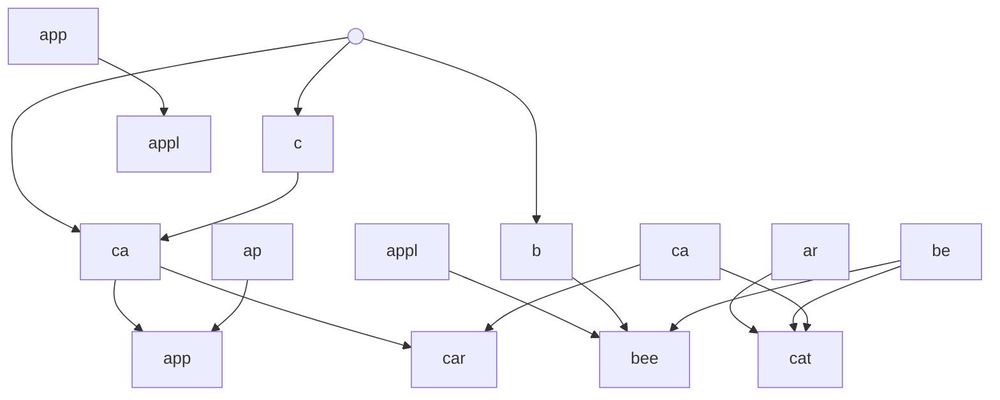
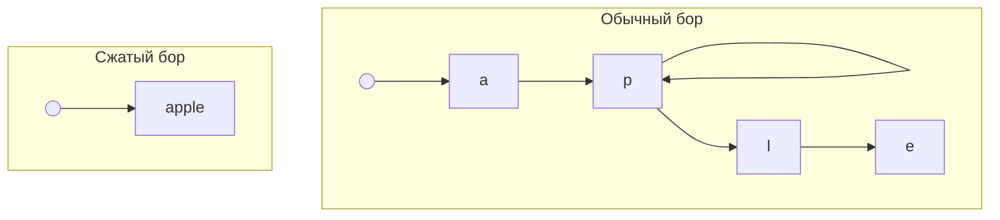
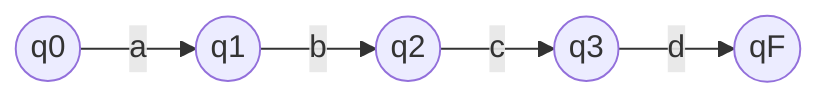
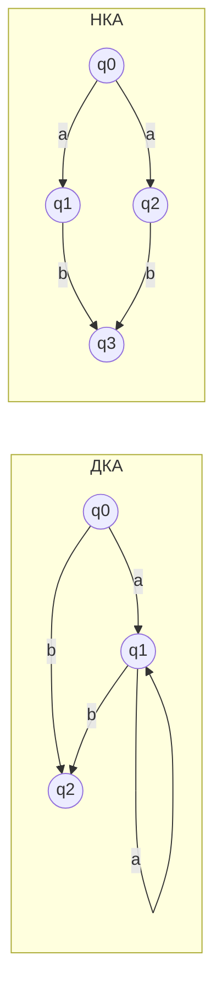
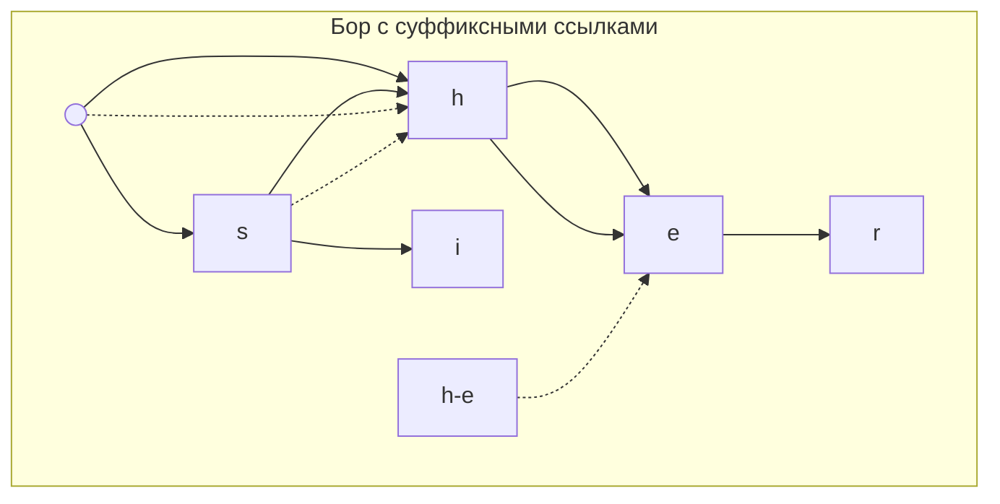

# AI конспект для лекции #19

## Введение: строка как структура данных

Строка — это последовательность символов (или графем), хранящаяся в памяти. С точки зрения структур данных, строка —
это:

- **Массив символов** — непрерывная область памяти с быстрым доступом по индексу O(1).
- **Неизменяемая (immutable)** в большинстве современных языков — любая операция создаёт новую строку.
- **С возможностью кодировок** — символы могут занимать разное число байтов (UTF-8, UTF-16).

## Сложность операций над строками

| Операция                               | Сложность                                     | Комментарий                                                         |
|----------------------------------------|-----------------------------------------------|---------------------------------------------------------------------|
| Доступ по индексу                      | O(1)                                          | Для фиксированных кодировок (но не для UTF-8 без декодирования)     |
| Конкатенация                           | O(n + m)                                      | Создаётся новая строка, копируются все символы                      |
| Извлечение подстроки                   | O(k)                                          | Обычно копирует k символов (в некоторых реализациях — ленивый срез) |
| Поиск подстроки (наивный)              | O(n × m)                                      | Для строк длиной n и m                                              |
| Поиск подстроки (КМП)                  | O(n + m)                                      | Линейный алгоритм                                                   |
| Поиск множества подстрок (Ахо-Корасик) | O(n + сумма длин паттернов + число вхождений) | Линейный по тексту                                                  |

## Прямой поиск подстроки (наивный алгоритм)

Самый простой способ найти подстроку `pattern` в тексте `text`:

1. Для каждой позиции `i` от 0 до `n - m`:
2. Сравниваем `pattern` с `text[i:i+m]`.
3. Если все символы совпали — нашли вхождение.

```text
text:   A B R A C A D A B R A
pattern: A B R A
↑
Сравниваем: A=A, B=B, R=R, A=A → совпало!
```

**Сложность:** O(n × m) в худшем случае.

**Пример худшего случая:** `text = "AAAAAAAAAB"`, `pattern = "AAAAB"` — на каждой позиции сравнение почти доходит до
конца.

## Алгоритм Кнута–Морриса–Пратта (КМП)

КМП — алгоритм, который находит подстроку в тексте за **линейное время** O(n + m). Идея: при несовпадении не
возвращаться к началу, а использовать уже проверенную информацию о совпавшей части.

### Префикс-функция

**Префикс-функция** `π[i]` для строки `s` — длина наибольшего собственного префикса строки `s[0..i]`, который
одновременно является её суффиксом.

```text
Строка: A B R A C A D A B R A
0 0 0 1 0 1 0 1 2 3 4
```

Алгоритм вычисления префикс-функции:

1. `π[0] = 0`.
2. Для `i` от 1 до n-1:
  - `j = π[i-1]`.
  - Пока `j > 0` и `s[i] != s[j]`, `j = π[j-1]`.
  - Если `s[i] == s[j]`, то `j++`.
  - `π[i] = j`.

### Концептуальная идея КМП

При поиске подстроки:

1. Сравниваем `text` и `pattern`, двигая указатель по `text` вперёд.
2. Если символы совпадают — двигаем оба указателя.
3. Если не совпадают:
  - Не сбрасываем указатель текста на начало!
  - Используем префикс-функцию: `j = π[j-1]`.
  - Продолжаем сравнение с текущего символа текста.

```text
text:   A B R A C A D A B R A
pattern: A B R A B
↑ не совпало (C ≠ B)
не сбрасываем на 0, а сдвигаем pattern, используя π
```

**Ключевое преимущество:** каждый символ текста проверяется не более одного раза.

### Применение КМП за пределами строк

Префикс-функция используется не только для поиска подстрок:

- **Поиск периодичности в строке** — если `n % (n - π[n-1]) == 0`, то строка периодическая с периодом `n - π[n-1]`.
- **Сжатие данных** — нахождение повторяющихся паттернов.
- **Поиск в последовательностях** — числа, массивы, генетические данные.

## Поиск множества подстрок

Когда нужно найти не одну подстроку, а множество (например, поиск нескольких ключевых слов в тексте), наивный подход O(
k × n × m) становится неприемлемым.

Решение — структуры данных, оптимизирующие поиск множества паттернов.

## Префиксное дерево (бор, trie)

**Бор (trie)** — дерево, в котором:

- Корень — пустая строка.
- Каждое ребро помечено символом.
- Путь от корня до узла образует строку (префикс).
- Узлы могут быть терминальными (отмечают конец слова).



**Операции:**

- Вставка — O(L), где L — длина слова.
- Поиск — O(L).
- Поиск всех слов с префиксом — O(P + количество результатов), где P — длина префикса.

### Реализация бора

Узел бора содержит:

- Массив или хэш-таблицу детей (символ → узел).
- Флаг терминальности.
- Дополнительные данные (например, индекс паттерна).

**Вставка:**

1. Начинаем с корня.
2. Для каждого символа слова:
  - Если ребра нет — создаём новый узел.
  - Переходим по ребру.
3. Помечаем последний узел как терминальный.

**Поиск:**

1. Начинаем с корня.
2. Для каждого символа:
  - Если ребра нет — слова нет.
  - Переходим по ребру.
3. Если узел терминальный — слово найдено.

### Сжатый бор

В обычном боре много узлов с одним ребёнком. **Сжатый бор (radix tree, Patricia trie)** объединяет такие узлы в один,
храня ребро как строку, а не символ.



**Преимущества:** экономия памяти, ускорение поиска.
**Недостаток:** усложнение операций вставки и удаления.

## Ахо-Корасик = бор + КМП

**Алгоритм Ахо-Корасик** — это конечный автомат для поиска множества паттернов в тексте за **линейное время** O(n +
сумма длин паттернов + число вхождений).

**Построение:**

1. Строим бор из всех паттернов.
2. Добавляем суффиксные ссылки (аналог префикс-функции КМП, но для бора).
3. Добавляем переходы для отсутствующих символов (с помощью суффиксных ссылок).
4. Получаем **детерминированный конечный автомат**.

**Поиск:**

1. Идём по тексту, начиная с корня.
2. Для каждого символа переходим в автомате.
3. Если текущий узел терминальный — нашли паттерн.
4. Проверяем все выходы через суффиксные ссылки (чтобы найти паттерны, оканчивающиеся в текущей позиции, но не
   являющиеся терминальным узлом).

## Что такое автомат (state machine)

**Автомат (конечный автомат)** — математическая модель, описывающая систему с конечным числом состояний и переходами
между ними.

**Компоненты:**

- Множество состояний (Q).
- Алфавит (Σ) — множество допустимых входных символов.
- Функция переходов (δ: Q × Σ → Q).
- Начальное состояние (q0).
- Множество финальных состояний (F).



## Детерминированный (ДКА) vs недетерминированный (НКА)

**Детерминированный конечный автомат (ДКА):** для каждого состояния и символа существует **ровно один** переход.

**Недетерминированный конечный автомат (НКА):** для одного состояния и символа может быть **несколько** переходов (или
ни одного).



**НКА** может находиться одновременно в нескольких состояниях. Для его выполнения нужно либо моделировать множество
состояний, либо преобразовать в ДКА (что может экспоненциально увеличить число состояний).

## Автомат в виде графа

Конечный автомат можно представить как **ориентированный граф**:

- Вершины — состояния.
- Рёбра — переходы (помечены символом).
- Начальное состояние — выделено.
- Финальные состояния — выделены (например, двойным кругом).

## Когда стоит использовать КА явно

Конечные автоматы стоит использовать явно, когда:

- Состояний немного (десятки-сотни).
- Логика ветвления сложная (парсинг, протоколы, игры).
- Нужна высокая производительность (переход за O(1)).
- Важна наглядность (автомат легко визуализировать).

## Как работает недетерминированный выбор

В НКА из одного состояния может быть несколько переходов по одному символу. Это значит, что автомат «угадывает»
правильный путь или проверяет все варианты одновременно.

**Способы реализации НКА:**

1. **Множество состояний** — поддерживаем все возможные состояния одновременно.
2. **Обход в глубину с возвратом (backtracking)** — проверяем пути по одному.
3. **Преобразование в ДКА** — строим эквивалентный ДКА (может быть экспоненциально больше).
4. **Ленивое преобразование** — строим переходы ДКА по мере необходимости.

## Алгоритм Ахо-Корасик: построение конечного автомата на основе бора

**Алгоритм Ахо-Корасик** превращает бор в детерминированный конечный автомат для поиска множества паттернов.

### Построение автомата

1. **Строим бор** из всех паттернов.
2. **Добавляем суффиксные ссылки:**
  - Для каждого узла находим вершину, соответствующую наибольшему собственному суффиксу строки, которая также является
    префиксом какого-либо паттерна.
  - Аналог префикс-функции КМП, но для дерева.
3. **Добавляем выходы (output links):**
  - Для каждого узла добавляем ссылки на терминальные узлы по суффиксным ссылкам.
  - Это позволяет найти все паттерны, оканчивающиеся в данной позиции.
4. **Добавляем fallback-переходы:**
  - Для каждого состояния и символа, по которому нет перехода, используем переход из состояния по суффиксной ссылке.
  - Это делает автомат **детерминированным**.



### Поиск в автомате Ахо-Корасик

1. Начинаем с корня.
2. Для каждого символа текста:
  - Переходим по автомату (используя переходы и fallback).
  - Проверяем выходы текущего узла (все найденные паттерны).
3. Все найденные паттерны выдаются в порядке их окончания в тексте.

**Сложность:** O(n + z), где z — число найденных вхождений.

## Ахо-Корасик vs КМП

| Аспект               | КМП                | Ахо-Корасик                                          |
|----------------------|--------------------|------------------------------------------------------|
| Количество паттернов | Один               | Множество                                            |
| Время построения     | O(m)               | O(сумма длин паттернов)                              |
| Время поиска         | O(n + m)           | O(n + z)                                             |
| Память               | O(m)               | O(сумма длин паттернов)                              |
| Применение           | Поиск одной строки | Поиск словаря, фильтрация токсичных слов, антивирусы |

## Другие алгоритмы поиска подстрок

| Алгоритм                 | Сложность                               | Особенности                                               |
|--------------------------|-----------------------------------------|-----------------------------------------------------------|
| **Наивный**              | O(n × m)                                | Простой, но медленный                                     |
| **КМП**                  | O(n + m)                                | Префикс-функция, линейный                                 |
| **Бойер-Мур**            | O(n × m) худший, O(n/m) средний         | Использует эвристики (плохих символов, хороших суффиксов) |
| **Регулярные выражения** | O(n × m) в худшем                       | Мощные, но потенциально медленные (backtracking)          |
| **Ахо-Корасик**          | O(n + z)                                | Множество паттернов, конечный автомат                     |
| **Рабин-Карп**           | O(n + m) средний                        | Хэширование, может давать ложные срабатывания             |
| **Суффиксный массив**    | O(n log n) построение, O(m log n) поиск | Мощный для множества запросов                             |

## Итоги лекции

- **Строка** — это структура данных с O(1) доступом по индексу, но с дорогой конкатенацией и изменением.
- **Наивный поиск** подстроки имеет сложность O(n × m).
- **Алгоритм КМП** — поиск одной подстроки за O(n + m) с помощью префикс-функции.
- **Префикс-функция** — основа КМП, показывает наибольший собственный префикс, равный суффиксу.
- **Бор (trie)** — дерево для хранения множества строк с общими префиксами.
- **Ахо-Корасик** — бор + суффиксные ссылки = конечный автомат для поиска множества паттернов за O(n + z).
- **Конечный автомат** — модель с конечным числом состояний и переходами между ними.
- **ДКА** — детерминированный (один переход), **НКА** — недетерминированный (несколько переходов).
- Ахо-Корасик используется в поисковых системах, антивирусах, фильтрации текста, анализе логов.